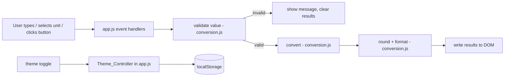
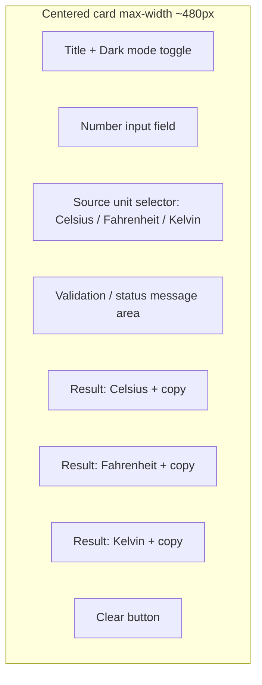

# Design Document

## Overview

The Temperature Converter is a single-page web app that converts a temperature value between Celsius, Fahrenheit, and Kelvin in real time. It is built with plain HTML, CSS, and vanilla JavaScript so it can run by simply opening `index.html` in a browser, with no server, bundler, or framework (R10.1, R10.2).

The design intentionally favors a small, readable codebase that reads like genuine first-year student work. Logic is split across two small JavaScript files: `js/conversion.js` holds pure, unit-testable functions (formulas, rounding, validation), and `js/app.js` wires those functions to the DOM. There are no classes, no design-pattern scaffolding, and no event-bus abstractions — just named functions and a couple of event listeners (R10.3).

Design goals mapped to requirements:

- Real-time updates without a submit button (R3) — one `input` listener on the field, one `change` listener on the unit selector.
- Correct, consistent conversions with sensible rounding (R2) — small pure functions plus one rounding helper.
- Clear feedback for bad input and impossible temperatures (R4, R5) — a validator returning a simple result object.
- Clean, modern, responsive UI with dark mode (R6, R7, R8) — a centered card, CSS custom properties, a 600px breakpoint, and a theme attribute on `<body>`.
- Portfolio extras: per-result copy, source value with unit symbol, and a clear/reset control (R9).

## Architecture

The app is a thin DOM layer over pure functions. Data flows one direction: a user event reads the current input, validation and conversion run as pure functions, and the result is written back to the DOM.



Key decisions and rationale:

- **Separate pure-logic file (`conversion.js`).** Keeping formulas, rounding, and validation as pure functions with no DOM access makes them easy to read and easy to unit-test, while keeping `app.js` focused on wiring (R10.3, supports testing strategy).
- **No debounce library.** A direct `input` listener already updates well within the 200 ms budget for a handful of arithmetic operations, so adding a debounce dependency would be unnecessary complexity (R3.1, R10.1).
- **Theme stored as a single attribute + single localStorage key.** Switching `data-theme` on `<body>` lets CSS handle all color changes, which is the simplest approach that satisfies persistence (R8).

## Project / File Structure

```
temperature-converter/
├── index.html          # Markup: card, input, unit selector, three result areas, buttons, theme toggle
├── css/
│   └── style.css       # All styling: palette, layout, card, responsive rules, dark mode
├── js/
│   ├── conversion.js   # Pure functions: formulas, rounding, validation, constants
│   └── app.js          # DOM wiring: event listeners, reads input, updates UI, theme control
├── README.md           # Project description, screenshot, how to run, how to deploy
├── LICENSE             # MIT license (optional but tidy for a public repo)
└── .gitignore          # Optional; e.g. .DS_Store, editor folders
```

`conversion.js` is loaded before `app.js` in `index.html` using plain `<script>` tags (no modules required), so its functions are available on the global scope for `app.js` to call. This keeps the "open the file and it works" promise intact (R10.2).

## UI Design Plan

The interface is a single centered card on a plain background. Everything the user needs is inside the card (R7.1).



Layout and styling plan:

- **Card container:** horizontally centered with equal left/right margins, rounded corners, max-width within 320–640px (480px target) (R7.1).
- **Consistent design tokens:** one color palette, one font family, and one spacing scale defined as CSS custom properties (e.g. `--space-1: 8px`, `--space-2: 16px`) and reused everywhere (R7.2).
- **Three result areas** labeled "Celsius", "Fahrenheit", "Kelvin", always visible even when empty (R7.5). Each result shows the converted value with its unit symbol and the source value for context (R9.4).
- **Focus and hover states:** interactive controls get a visible focus outline distinct from their resting state, and a hover change that reverts on pointer-out (R7.3, R7.4).
- **Dark mode toggle:** a visible, always-available control in the card header (R8.1).
- **Copy controls:** a small copy button next to each result, shown when a valid conversion is displayed (R9.1).
- **Clear control:** a reset button that empties input, results, and messages (R9.5, R9.6).

Responsive plan with a single breakpoint at 600px:

- **≤ 600px:** input, selector, and results stack vertically in one column (R6.2).
- **> 600px:** controls/results use a multi-column arrangement with at least 16px gap between adjacent controls (R6.3).
- No horizontal scrolling from 320px to 1920px (R6.1); body text ≥ 16px (R6.4); interactive controls sized at least 44×44px (R6.5).
- Dark mode keeps text/background contrast ≥ 4.5:1 by choosing palette values that meet that ratio (R8.6).

## Components and Interfaces

All "components" are plain functions, not classes. They are grouped by responsibility.

### Conversion_Engine (`js/conversion.js`)

Pure functions that compute conversions from a source value and source unit.

```javascript
// Returns { c, f, k } as numbers, given a numeric value and its unit ("C" | "F" | "K")
function convertAll(value, unit) { ... }

// Individual formula helpers used by convertAll
function cToF(c) { return (c * 9 / 5) + 32; }
function cToK(c) { return c + 273.15; }
function fToC(f) { return (f - 32) * 5 / 9; }
function kToC(k) { return k - 273.15; }
```

`convertAll` first normalizes the input to Celsius, then derives the other units, so the three formulas in R2.1–R2.3 are expressed once. Responsible for R2.1–R2.4.

### Rounding / Formatting helper (`js/conversion.js`)

One small helper handles display formatting for every value.

```javascript
// Round to 2 decimals, ties away from zero, then trim trailing zeros.
// e.g. 32 -> "32", 98.6 -> "98.6", 0.005 -> "0.01", -0.005 -> "-0.01"
function formatTemp(value) { ... }
```

Responsible for R2.5 (nearest 0.01, ties away from zero, no trailing zeros).

### Input_Validator (`js/conversion.js`)

A single function returns a simple result object describing validity. No exceptions, no rule engine.

```javascript
// Returns one of:
//   { state: "empty" }
//   { state: "invalid" }                       // not a number / bad characters
//   { state: "belowZero", min: <number> }      // below absolute zero for unit
//   { state: "ok", value: <number> }
function validate(rawText, unit) { ... }
```

- Numeric format check: trimmed text up to 15 characters, only digits, at most one leading minus, at most one decimal point, and must parse to a finite number (R4.1, R4.2).
- Empty check returns `"empty"` (R4.3, R3.3).
- Absolute-zero check is a simple per-unit threshold lookup compared against the entered value, with the threshold rounded to 2 decimals (R5.1, R5.3).

### Theme_Controller (`js/app.js`)

Three small functions handle theming via a `data-theme` attribute on `<body>` and one localStorage key.

```javascript
function applyTheme(theme) { ... }   // set body[data-theme], used on load and toggle
function toggleTheme() { ... }       // flip light/dark, save, apply
function loadTheme() { ... }         // read localStorage, default to "light"
```

Responsible for R8.1–R8.5.

### UI wiring (`js/app.js`)

Reads the DOM, calls the pure functions, and writes results back. One `input` listener on the field and one `change` listener on the unit selector drive real-time conversion (R3.1, R3.2). Additional listeners handle copy buttons (R9.1–R9.3), the clear button (R9.5, R9.6), and the theme toggle.

```javascript
function update() { ... }            // read input + unit, validate, convert, render or show message
function renderResults(result, value, unit) { ... }
function showMessage(text) { ... }   // validation / status messages
function clearAll() { ... }          // reset input, results, messages
function copyValue(text) { ... }     // navigator.clipboard with fallback
```

Copy uses `navigator.clipboard.writeText` when available, with a simple `document.execCommand('copy')` fallback on a temporary textarea; a confirmation message shows for 1–3 seconds, and a failure message is shown if both paths fail (R9.2, R9.3).

## Data Models

There is no persisted domain data beyond the theme. The "models" are small plain objects and constant tables in `conversion.js`.

Constants:

```javascript
// Unit symbols for display (R9.4)
const SYMBOLS = { C: "°C", F: "°F", K: "K" };

// Absolute zero threshold per source unit, rounded to 2 decimals (R5.1, R5.3)
const ABSOLUTE_ZERO = { C: -273.15, F: -459.67, K: 0 };
```

Validation result object (returned by `validate`):

| Field   | Type     | Meaning                                                        |
|---------|----------|----------------------------------------------------------------|
| `state` | string   | `"empty"` \| `"invalid"` \| `"belowZero"` \| `"ok"`            |
| `value` | number   | Parsed numeric value (present when `state === "ok"`)           |
| `min`   | number   | Minimum valid value for the unit (present when `"belowZero"`)  |

Conversion result object (returned by `convertAll`):

| Field | Type   | Meaning                  |
|-------|--------|--------------------------|
| `c`   | number | Value in Celsius         |
| `f`   | number | Value in Fahrenheit      |
| `k`   | number | Value in Kelvin          |

Theme persistence model: a single localStorage entry, key `"theme"`, value `"light"` or `"dark"` (R8.5).

## Correctness Properties

*A property is a characteristic or behavior that should hold true across all valid executions of a system — essentially, a formal statement about what the system should do. Properties serve as the bridge between human-readable specifications and machine-verifiable correctness guarantees.*

The conversion, rounding, and validation logic in `js/conversion.js` are pure functions over a large numeric/string input space, which makes them well suited to property-based testing. The properties below were derived from the prework analysis and consolidated to remove redundancy (the three per-direction formula criteria collapse into one conversion property; the two validation criteria collapse into one; the absolute-zero criteria collapse into one boundary property). UI layout, styling, theming visuals, copy side-effects, and project-structure criteria are covered by example, smoke, or manual checks instead (see Testing Strategy).

### Property 1: Conversion correctness

*For any* finite numeric value and any source unit (Celsius, Fahrenheit, or Kelvin), `convertAll` SHALL produce the three unit values matching the standard formulas — Fahrenheit = (C × 9/5) + 32, Kelvin = C + 273.15, and the equivalent inversions — to within a small floating-point tolerance.

**Validates: Requirements 1.3, 2.1, 2.2, 2.3**

### Property 2: Rounding bounds and ties away from zero

*For any* finite numeric value, `formatTemp` SHALL produce a string with at most two digits after the decimal point, no trailing zeros, whose numeric value differs from the input by at most 0.005, and where a value exactly halfway between two 0.01 steps rounds away from zero.

**Validates: Requirements 2.5**

### Property 3: Conversion round-trip within 0.01

*For any* finite numeric value and any source unit, converting that value into another unit and back into the original unit SHALL yield a final value within 0.01 of the original.

**Validates: Requirements 2.6**

### Property 4: Numeric validation accept/reject

*For any* string of at most 15 characters: IF it is a well-formed finite number (digits, at most one leading minus, at most one decimal point) THEN `validate` SHALL return state `"ok"`; and *for any* string containing a character outside that allowed set, `validate` SHALL return state `"invalid"`.

**Validates: Requirements 4.1, 4.2**

### Property 5: Absolute-zero boundary behavior

*For any* source unit, a value exactly equal to that unit's absolute-zero threshold (compared at 2 decimal places) SHALL validate as `"ok"`, while any value below the threshold SHALL validate as `"belowZero"`.

**Validates: Requirements 5.1, 5.3**

### Property 6: Source result rendering shows formatted value and unit symbol

*For any* finite numeric value and any source unit, the rendered source result SHALL contain the value formatted by `formatTemp` together with the correct unit symbol (°C, °F, or K).

**Validates: Requirements 2.4, 9.4**

### Property 7: Theme persistence round-trip

*For any* theme in {light, dark}, saving the theme to storage and then loading it SHALL return the same theme.

**Validates: Requirements 8.3, 8.5**

## Error Handling

Errors here are user-input problems and one external side-effect (clipboard), not exceptions. The strategy is to keep the UI in a clear, predictable state at all times.

- **Empty input (R3.3, R4.3):** `validate` returns `"empty"`. The UI clears all three results, shows no converted zero, and shows a "value required" message only when appropriate (no message in the cleared/idle state per R3.3; the required message applies to the validation context of R4.3). Results stay blank.
- **Non-numeric / malformed input (R4.2, R4.4):** `validate` returns `"invalid"`. The UI shows a "please enter a valid number" message and clears any previously displayed results; conversions are withheld until corrected (R4.5).
- **Below absolute zero (R5.1, R5.2, R5.4):** `validate` returns `"belowZero"` with the unit's minimum. The UI shows a message naming the value as below absolute zero and stating the minimum valid value for the selected unit; conversions are withheld until the value is at or above the threshold (R5.5).
- **Clipboard failure (R9.3):** `copyValue` tries `navigator.clipboard.writeText`; if unavailable or rejected, it falls back to a temporary textarea + `document.execCommand('copy')`. If both fail, the UI shows a "couldn't copy" message and leaves displayed results unchanged.
- **Defensive simplicity:** functions in `conversion.js` assume they receive the value/unit handed to them by `app.js`; validation happens before conversion, so `convertAll` is only called on numbers that already passed `validate`. This avoids scattering guard clauses through the pure functions.

## Testing Strategy

The project uses a lightweight dual approach appropriate to a small vanilla-JS submission: property-based tests for the pure logic, plus a small number of example and manual checks for UI, styling, and side-effects. Keeping the logic in `js/conversion.js` (no DOM access) is what makes the property tests straightforward.

**Property-based tests (pure logic in `conversion.js`):**

- Use a small property-testing library for JavaScript (for example, `fast-check`) run with a simple test runner. This is the one optional dev-time dependency; it is not shipped with the app and does not affect the "open `index.html`" runtime constraint (R10.1, R10.2).
- Implement each of the seven correctness properties as a SINGLE property-based test.
- Run a minimum of 100 iterations per property test.
- Tag each test with a comment referencing its design property, format:
  `// Feature: temperature-converter, Property 1: Conversion correctness`
- Generators should include negatives, zero, decimals, large magnitudes, and values near the absolute-zero thresholds and rounding half-steps (0.005 boundaries) so edge cases from R2.5 and R5.3 are exercised.

**Example-based unit tests (concrete behavior and edge cases):**

- Unit selector has exactly three options and defaults to Celsius (R1.1, R1.2).
- Empty-input behavior: results cleared, no zero, no error in idle state (R3.3); changing unit while empty leaves output blank (R1.4).
- Invalid-input behavior: numeric error shown, unit retained, results cleared (R1.5, R4.4); correcting to valid removes message and shows results (R4.5).
- Below-zero message names the minimum and withholds results; recovering resumes conversion (R5.2, R5.4, R5.5).
- Real-time wiring: dispatching an `input` event and a `change` event updates results with no button press (R3.1, R3.2).
- Copy: with a mocked clipboard, the correct value is written and a confirmation shows for 1–3 seconds (R9.2); on rejection, a failure message shows and results are unchanged (R9.3); copy controls present only with a valid conversion (R9.1).
- Clear control empties input, results, and messages (R9.5, R9.6).
- Theme: toggle exists and flips `data-theme` (R8.1, R8.2); no stored theme defaults to light (R8.4).

**Smoke / static checks (one-time):**

- Body text ≥ 16px and interactive controls ≥ 44×44px (R6.4, R6.5).
- Dark-mode palette meets ≥ 4.5:1 contrast (R8.6).
- Project uses only HTML/CSS/vanilla JS, runs by opening the file, and keeps a small readable file set (R10.1–R10.3).

**Manual / visual checks (responsive and visual criteria):**

- No horizontal scrolling and correct single-column (≤600px) vs multi-column (>600px) layout at representative widths from 320px to 1920px (R6.1, R6.2, R6.3).
- Centered card styling, consistent palette/font/spacing, and visible focus/hover states (R7.1–R7.4); three labeled result areas always visible (R7.5).

## Deployment Plan

The app is static, so deployment is simple and free via GitHub Pages.

1. **Run locally first:** double-click `index.html` (or open it in a browser) and confirm conversion, validation, dark mode, copy, and clear all work (R10.2).
2. **Create a GitHub repository** (e.g. `temperature-converter`) and push the files:
   ```
   git init
   git add .
   git commit -m "Temperature converter - SkillCraft Task 1"
   git branch -M main
   git remote add origin https://github.com/<username>/temperature-converter.git
   git push -u origin main
   ```
3. **Enable GitHub Pages:** in the repo, go to Settings → Pages, choose the `main` branch and root (`/`) folder, and save. GitHub serves the site at `https://<username>.github.io/temperature-converter/`.
4. **Verify the live URL** loads `index.html` and behaves the same as local.
5. **Add the live link to the README** so reviewers can try it directly.

## GitHub Repository Structure

```
temperature-converter/
├── index.html
├── css/
│   └── style.css
├── js/
│   ├── conversion.js
│   └── app.js
├── README.md          # Title, short description, live demo link, screenshot,
│                      #   features, how to run locally, how it was built
├── LICENSE            # MIT (optional, good practice for a public portfolio repo)
└── .gitignore         # Optional: OS/editor noise (.DS_Store, .vscode/, etc.)
```

README contents (suggested): project title and one-line description, a screenshot or GIF, the live GitHub Pages link, a short feature list (real-time conversion, three units, validation including absolute-zero, dark mode, copy, responsive), a "How to run" note ("clone and open `index.html`"), and a brief "Built with HTML, CSS, and vanilla JavaScript" line for authenticity (R10.3). The `LICENSE` and `.gitignore` are optional but make the repository look complete and intentional.
